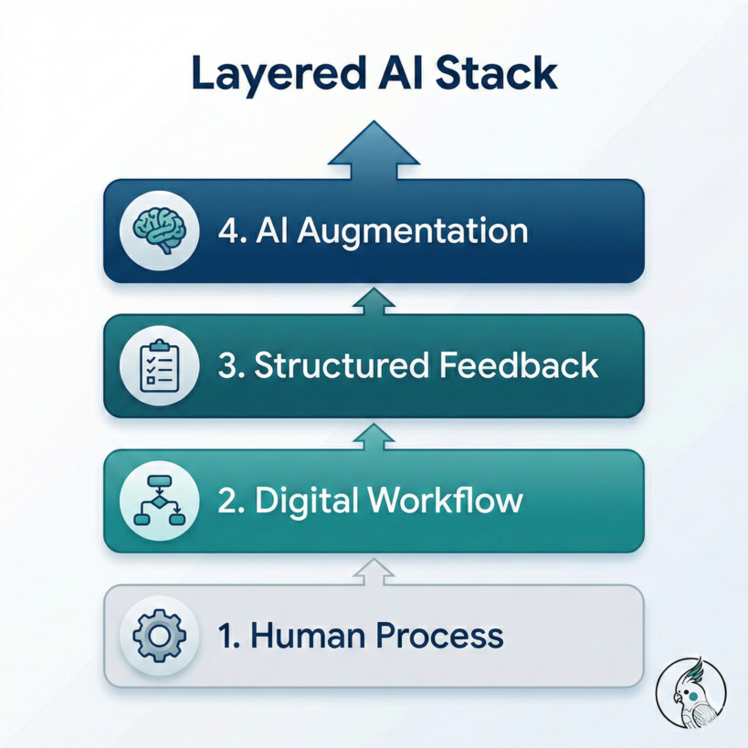
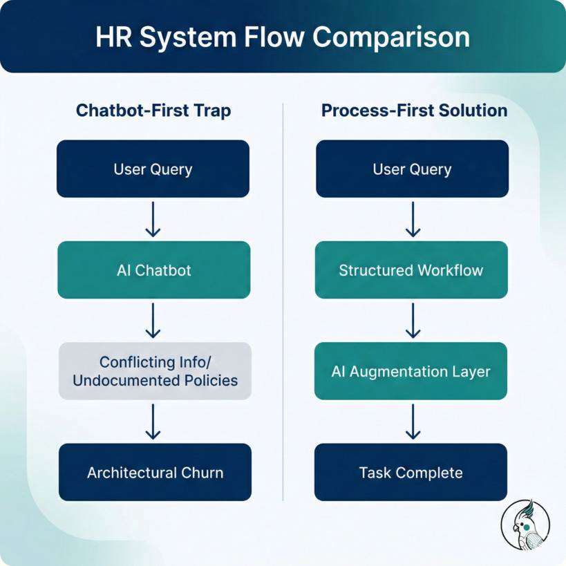
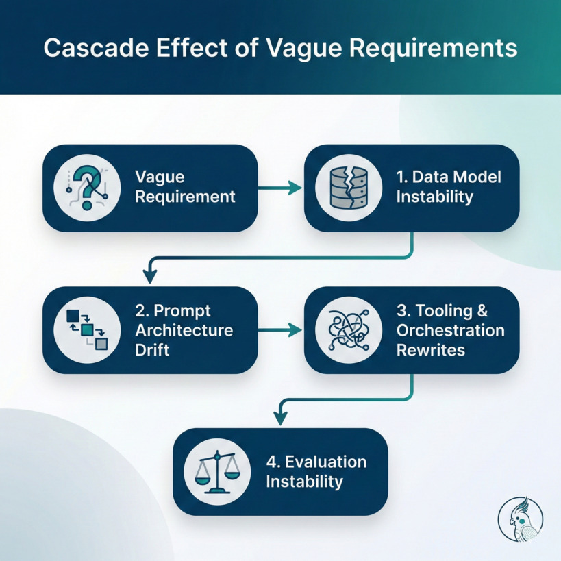
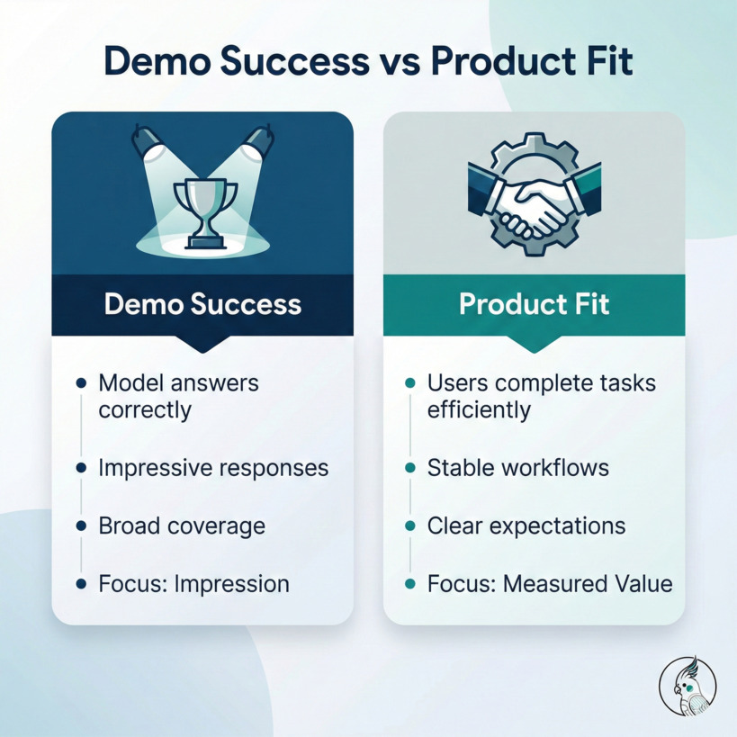

# Requirement Engineering in the Age of AI

The AI demo worked.

Stakeholders were impressed.  
The assistant answered complex questions.  
It even handled edge cases.

Three months later, the architecture had been rewritten twice.

The model wasn’t the problem.

The requirements were.

In AI startups, we often assume that better models lead to better products. But in practice, the systems that survive production are not the ones with the most intelligence — they’re the ones built on disciplined requirement engineering.

In fact:

> AI increases the cost of vague thinking.

And that changes everything.

---

# Why This Matters Now

Prototyping with large language models has never been easier.

You can:
- Connect to an API
- Add a retrieval layer
- Wrap it with a chat UI
- Ship a demo in days

But product fit is not demo success.

In fast-moving AI environments, product managers face constant pressure:
- “Can we add AI to this?”
- “Can we automate this with an agent?”
- “Can we make it conversational?”

The real question is rarely asked:

**Do we fully understand the workflow we’re augmenting?**

When requirement engineering is weak, AI doesn’t fix the ambiguity — it amplifies it.

---

# The Mental Model: AI as a Layer, Not a Foundation

A useful way to think about AI systems is as a layered stack:

1. **Human Process**
2. **Digital Workflow**
3. **Structured Feedback**
4. **AI Augmentation**

AI belongs at the top — not at the base.

If the human process is undefined,  
the digital workflow is unstable.  

If the workflow is unstable,  
structured feedback is unreliable.  

If feedback is unreliable,  
AI behavior drifts.

You don’t install smart automation before wiring the house.

AI should clarify, guide, and reduce friction — not define the process itself.

---

# A Practical Example: The HR System Trap

Imagine a large company HR system.

The initial request:

> “We want an AI assistant that helps employees understand HR processes.”

Sounds reasonable.

But what does that actually mean?

- Leave policies?
- Payroll adjustments?
- Escalation paths?
- Region-specific rules?
- Exceptions for managers?

If the process is partially documented and inconsistently applied, a chatbot-first approach creates new problems:

- It reflects contradictions.
- It exposes undocumented policies.
- It creates expectation mismatches.
- It forces architectural changes every time a clarification is discovered.

Now contrast this with a process-first approach:

1. Map HR workflows explicitly.
2. Digitize decision trees.
3. Define structured pathways.
4. Track where users struggle.
5. Introduce AI for clarifications and complex edge cases.

In this model, AI doesn’t invent policy.  
It strengthens the weak points.

That difference determines whether the system stabilizes — or churns for months.

---

# How Vague Requirements Cascade in AI Systems

In traditional software, unclear requirements cause friction.

In AI systems, they cause instability.

Let’s break it down.

## 1. Data Model Instability

When requirements shift:
- Schemas evolve.
- Metadata changes.
- Edge cases multiply.

In AI systems, this impacts:
- Retrieval logic
- Context construction
- Evaluation datasets
- Prompt conditioning

Every requirement change propagates upward.

---

## 2. Prompt Architecture Drift

When the underlying process changes:
- System prompts must change.
- Tool instructions must adapt.
- Guardrails must shift.
- Output formatting must evolve.

You’re no longer tuning a system.  
You’re redefining its behavior repeatedly.

---

## 3. Tooling and Orchestration Rewrites

In agentic or tool-using systems:

- Tool signatures evolve.
- API contracts move.
- Access policies change.
- Exception handling expands.

This affects:
- Observability
- Logging
- Auditing
- Governance

Each unclear requirement increases architectural surface area.

---

## 4. Evaluation Instability

This is the silent failure mode.

If requirements are not stable, you cannot:

- Define consistent success metrics
- Build reliable evaluation datasets
- Measure improvement meaningfully

So teams optimize for:
> “It feels smarter.”

Instead of:
> “Users complete tasks faster with higher confidence.”

That’s how product fit quietly erodes.

---

# Demo Success vs Product Fit

It’s useful to distinguish the two.

AI should not reduce added value.

If engagement drops,  
If trust declines,  
If users slow down,  

Then the integration failed — even if the demo impressed everyone.

---

# This Is Not an Anti-AI Argument

There are cases where AI-first exploration reveals unknown workflows.

There are products that are inherently AI-native.

The argument here is not:

- “Always process first.”
- “Never prototype with AI.”
- “Chatbots are harmful.”

The argument is simpler:

Undefined foundations increase architectural volatility.

AI systems amplify ambiguity.  
They do not neutralize it.

---

# Practical Guidance for Product Managers in AI Startups

If you’re responsible for product direction, consider:

### 1. Define Success Before Capability

Before asking, “Can AI do this?”  
Ask, “How will we measure added value?”

Engagement?  
Completion rate?  
Time saved?  
Error reduction?

Without this, requirement engineering is incomplete.

---

### 2. Map Human Workflows Explicitly

Document:
- Decision paths
- Exception routes
- Escalation logic
- Region-specific variations

AI should attach to structure — not substitute for it.

---

### 3. Protect Architecture from Requirement Volatility

When requirements shift weekly:
- Architecture destabilizes.
- Evaluation resets.
- Reimplementation cycles begin.

Disciplined requirement engineering reduces cascading change.

---

### 4. Treat AI as Capability Injection

AI is powerful when it:
- Clarifies ambiguity
- Handles edge cases
- Summarizes complexity
- Guides users contextually

It is fragile when it:
- Defines process
- Replaces structure
- Masks organizational ambiguity

---

# The Deeper Insight

AI systems are probabilistic, adaptive, and context-sensitive.

Traditional software degrades linearly under ambiguity.

AI systems degrade non-linearly.

Because ambiguity spreads.

And that’s why:

> AI increases the cost of vague thinking.

The difference between an impressive demo and a production-grade AI system is rarely the model.

It is almost always the quality of requirement engineering.

---

# Closing Thought

Connecting language intelligence to real-world utility requires more discipline than intelligence.

If we want AI systems that survive contact with reality, we must invest as much in defining problems as we do in solving them.

Product fit does not emerge from capability.

It emerges from clarity.
